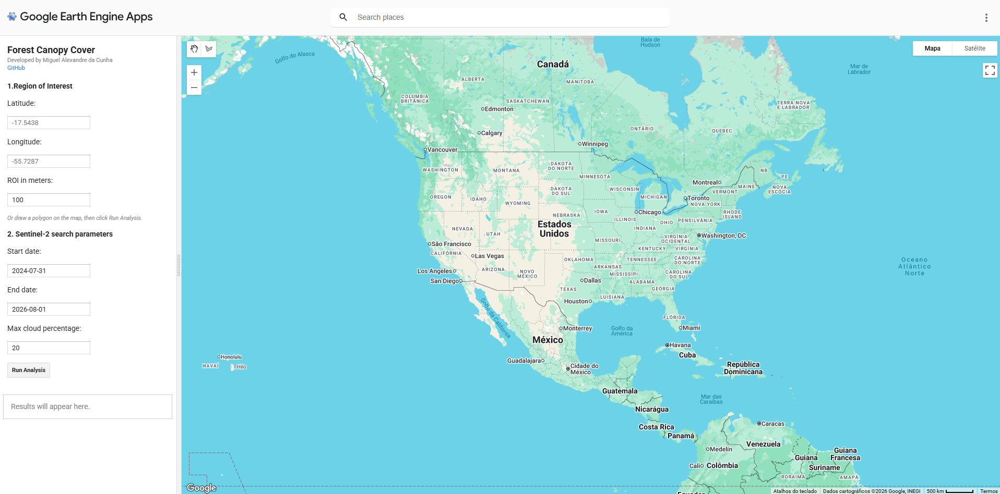
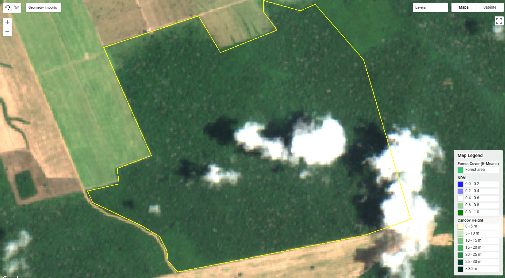
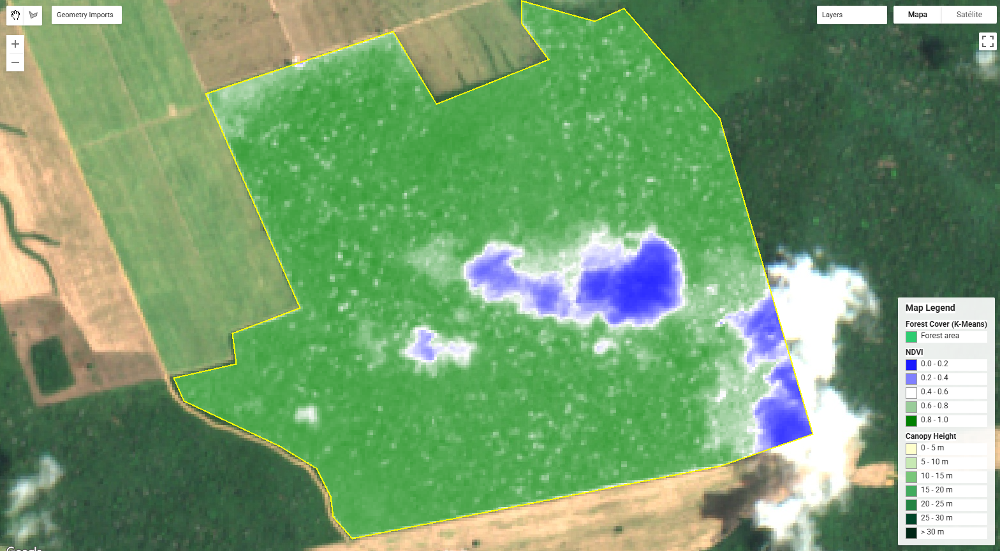
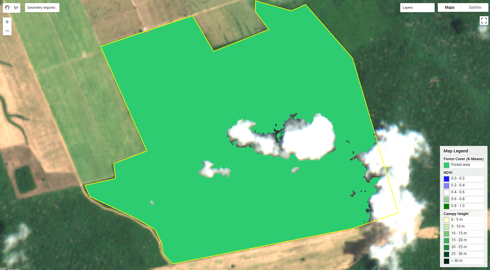
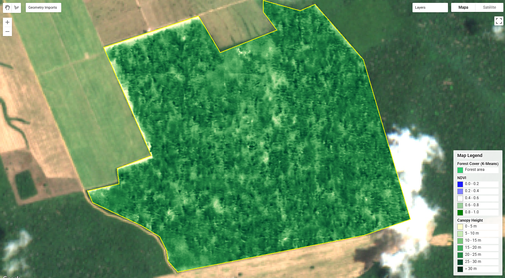

# Forest Canopy Cover

  
  
  

Técnica de Cassiano Messias, Guilherme Correia e Miguel Cunha no GEE para análise interativa de cobertura florestal a partir de imagens Sentinel-2. As funcionalidades incluem classificação não supervisionada (K-Means), estimativa de altura de dossel (Meta Canopy Height), cálculo de estatísticas por área de interesse (ROI) e visualização dinâmica.

## Como usar

### 1. Definir a área de interesse
- Informe Latitude, Longitude e o tamanho da área de interesse (em metros), ou
- Desenhe um polígono diretamente no mapa.

### 2. Configurar a busca do Sentinel-2
- Defina a data inicial e a data final (formato `YYYY-MM-dd`).
- Defina o percentual máximo de nuvens nas imagens.

### 3. Análise
Clique em **Run Analysis** para:
- Carregar o mosaico Sentinel-2 mais adequado para o ROI;
- Calcular o NDVI e classificar a cobertura florestal (K-Means);

- Estimar a altura do dossel e o percentual de área com árvores altas.

## Metodologia

### Classificação K-Means

A classificação não supervisionada, baseada no NDVI `(B8 - B4) / (B8 + B4)` calculado sobre o mosaico do Sentinel-2:

1. Amostragem de até 5000 pixels de NDVI na ROI (10 m de resolução, `seed: 42`).
2. Treinamento de um `ee.Clusterer.wekaKMeans(2)` (floresta e não-floresta) sobre as amostras.
4. Identificação do cluster "floresta" como aquele com maior NDVI médio.
5. Cálculo do percentual de floresta via histograma de frequência dos clusters.

O threshold é a média entre os dois centros de cluster e serve apenas como referência, os grupos são definidos estatisticamente a cada execução, podendo variar entre AOIs e datas distintas.

### Altura de dossel

Dataset global de altura de vegetação desenvolvido pela **Meta** em parceria com o **World Resources Institute (WRI)** (`projects/meta-forest-monitoring-okw37/assets/CanopyHeight`), com resolução espacial de 1 metro.

- Gerado por um modelo de IA treinado sobre imagens ópticas de altíssima resolução (Maxar Vivid2 - 0,5 m), calibrado com dados de referência LiDAR aéreo e GEDI (espacial).
- Estima a altura do dossel normalizada em relação ao solo.
- Sensível a nuvens/sombras: em regiões de cobertura de nuvens persistente pode apresentar artefatos.

No app, esse dado alimenta:
- Camada de altura de dossel (0–30 m).
- Estatísticas de altura máxima e média na ROI.
- Percentual de área com altura acima de 5 m.

## Licença

Este projeto é distribuído sob a licença GNU General Public License v3.0.

Você é livre para usar, estudar, modificar e distribuir este software, desde que mantenha os avisos de copyright e a licença original em qualquer cópia ou trabalho derivado, conforme exigido pela GPL-3.0.
